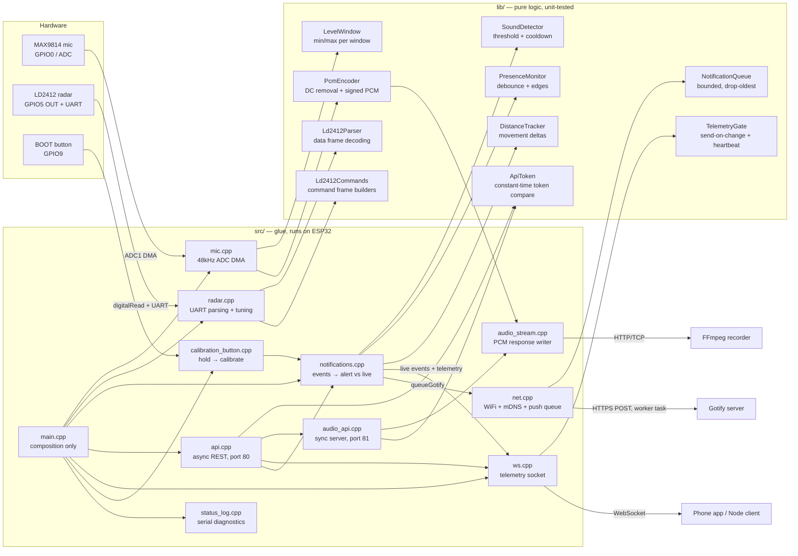

# Architecture

How the firmware is structured and why. For wiring see
[hardware.md](hardware.md); for build/flash see [flashing.md](flashing.md).

## Design principle

**Decision logic is separated from I/O.** Everything that decides *whether* to
act — notify, send a telemetry frame, accept a token — lives in
[`lib/`](../lib/) as header-only, pure C++ classes with no Arduino dependency:
time is injected as a parameter, never read inside, and there is no heap or
hardware access. That makes the interesting behavior unit-testable on the host
(`pio test -e native`) without a board. Everything that touches hardware or
the network stays in [`src/`](../src/) as thin glue.

## Loop lifecycle

`setup()` runs once after boot/reset: serial, mic, radar and button init,
radar tuning (per-gate sensitivities via the LD2412 command protocol), WiFi
connect, push worker start, mDNS announcement, API start, and a "Sensor node
online" alert. Then `loop()` repeats forever:

1. **`micSampleWindow()`** — waits for the next 50ms `LevelWindow` produced by
  the dedicated ADC task. Hardware-timed DMA sampling continues at 48kHz
  while the loop performs network work, so short sounds cannot fall into a
  scheduling gap. The last completed window is kept for the HTTP API.
2. **`radarPoll()`** — feeds pending LD2412 UART bytes into `Ld2412Parser`
   for distance/energy reports.
3. **`calibrationButtonPoll()`** — BOOT button held ~1s requests radar
   background calibration (also available via `POST /calibrate` and the `ws`
   `calibrate` command).
4. **`pollCalibrationRequest()`** — runs a pending calibration request here,
   on the sensor loop.
5. **`notifyPresenceChanges()`** — feeds the radar pin into `PresenceMonitor`;
   alerts "Person detected at X" / "Presence cleared" on debounced edges.
6. **`notifyMovement()`** — while present, `DistanceTracker` emits "Person
   moved to X" when the distance shifts beyond `DISTANCE_DELTA_CM`. Live sink
   only — the socket already streams position continuously.
7. **`notifyLoudSounds()`** — feeds the window's peak-to-peak into
   `SoundDetector`; alerts "Sound detected" above threshold, then cools down.
8. **`wsPublishTelemetry()`** — builds the sensor snapshot and hands it to the
   socket when `TelemetryGate` says it changed or the heartbeat is due.
9. **`logStatusEverySecond()`** — one diagnostic line per second on serial.

One pass takes ~50ms because it waits for the next mic window. Nothing in the
loop blocks on the network: pushes are queued for a worker task, and telemetry
frames are dropped rather than buffered when the socket is backed up.

## Crossing the task boundary

AsyncTCP runs handler callbacks on its own task, and blocking that task stalls
every connection on port 80. Three rules follow.

**Handlers never block.** `POST /calibrate` and the socket's `calibrate`
command only set a flag; `pollCalibrationRequest()` runs the actual command on
the sensor loop. `radarCalibrateBackground()` waits ~300ms for UART
acknowledgements, which was harmless on the old dedicated server task and is
not harmless here. The BOOT button goes through the same request path, so
there is one way to start a calibration rather than two.

**Handlers never read sensor state.** If callbacks called `radarReport()` and
`micLastWindow()` directly, every sensor value would become shared mutable
state across three tasks. Instead `wsPublishTelemetry()` runs on the sensor
loop, snapshots the values there, renders the JSON, and hands a finished
string to the socket.

**The loop never holds a client handle.** `AsyncWebSocket::client()` returns a
raw pointer after releasing the library's client lock, and `_handleDisconnect()`
erases that client from the AsyncTCP task — so a pointer held across a send can
dangle. The loop keeps only an atomic client id and goes through the id-based
API (`text(id, …)`, `availableForWrite(id)`, `close(id, …)`), which holds the
lock for the whole lookup-and-send. `TelemetryGate` stays loop-task-local for
the same reason: a reconnect is detected by comparing ids in the loop rather
than by resetting the gate from the callback.

## Ports

| Port | Server | Why |
|---|---|---|
| 80 | `AsyncWebServer` | `/status`, `/calibrate`, `/ws` — many short requests plus one long-lived socket |
| 81 | `WebServer` (sync) | `/audio.pcm` — holds its socket for the whole recording in a dedicated task |

The PCM stream cannot move to the async server without rewriting it as a
chunked response whose filler never blocks; `micReadPcm()` blocks by design.
Keeping it synchronous on its own port isolates that from the migration.
WebServer.h and ESPAsyncWebServer.h also both define `HTTP_GET`, so the two
live in separate translation units.

## Audio pipeline

The microphone task reads 12-bit ADC1 samples from DMA, updates the sound-level
window, and passes each sample through `PcmEncoder`. The encoder tracks and
removes the MAX9814's DC bias, then maps the complete ADC range into signed
16-bit little-endian PCM without clipping. When a client is recording, samples
also enter a bounded 8192-sample ring buffer.

`api.cpp` authenticates the request on port 80; `audio_api.cpp` authenticates
`GET /audio.pcm` on port 81 and `audio_stream.cpp` drains the ring buffer to
the HTTP client from a dedicated task, so network backpressure never blocks
ADC sampling or the sensor loop. When the buffer fills, new stream samples are
dropped and counted in `audioDroppedSamples`. Sound detection still uses every
ADC sample regardless of stream state.

## Delivery semantics

Events go to two sinks with deliberately different guarantees.

**Alerts — presence, sound, boot, calibration.** These are worth waking a
phone for, so they go through `queueGotify()` into a bounded
`NotificationQueue` drained by a worker task:

- **Queueing always succeeds**, so a detector confirms delivery immediately
  and the sensor loop never waits for the network. Retries, timeouts and
  backoff are the worker's problem.
- **The worker retries** a failed push up to `GOTIFY_MAX_ATTEMPTS` times,
  waiting `GOTIFY_RETRY_BACKOFF_MS` between attempts so a dead server is not
  hammered.
- **A full queue discards the oldest message**, not the newest. An alert about
  what is happening now beats one about what happened a minute ago. Discards
  and give-ups are counted and exposed as `pushLost` on `GET /status`.

**Live updates — movement and continuous telemetry.** These go to the
WebSocket only:

- **Frames are disposable.** If no client is connected, or the client's queue
  is full, the frame is dropped. `TelemetryGate` does not record it as sent,
  so the next loop pass retries — but nothing is ever buffered on behalf of an
  absent client.
- **Send on change, not on schedule.** A frame goes out only when the sensor
  values differ from the last delivered one and `WS_MIN_PUSH_INTERVAL_MS` has
  passed. The fingerprint covers every field in the frame except `uptimeMs`,
  so a ticking clock never counts as a change but a rising
  `audioDroppedSamples` does.
- **A heartbeat every `WS_HEARTBEAT_MS`** goes out regardless, so a client can
  distinguish a still room from a dead link.

The detector contracts are unchanged — debounce for presence, cooldown for
sound, delta plus min-interval for movement — but "delivered" now means
"handed to the right sink" rather than "the HTTP POST returned 2xx".

## Authentication

One token guards everything. On the async server it is enforced by an
`AsyncMiddlewareFunction` attached to each handler, including the WebSocket:
the middleware chain runs before `AsyncWebSocket::handleRequest()`, so a bad
token gets a real HTTP `401` and the connection is never upgraded. Rejecting
after the handshake would look like a mystery disconnect to the client.

The comparison itself stays in `lib/auth/ApiToken.h` (constant-time, native
tests) and both servers call the same `apiTokenAccepted()`, so there is one
implementation of the firmware's only security-critical decision.

Browsers cannot set headers on a WebSocket handshake, which is why this
endpoint targets native and Node clients rather than a browser dashboard.

## Signal reference (mic)

12-bit ADC, MAX9814 biased at ~1.25V:

| Condition | Typical reading |
|---|---|
| Silent room | micMin ≈ 2600, micMax ≈ 2800, micPP ≈ 200–300 |
| Loud clap nearby | micPP ≈ 1500–4095 |
| Mic disconnected/floating | micMin ≈ 0, micMax ≈ 300 (WiFi noise pickup) |

The last row is the diagnostic signature for a wiring fault: a healthy mic
always shows the DC bias (~2600), a floating pin bounces near ground.

## Radar tuning and calibration

The LD2412 command protocol lives in `lib/ld2412/Ld2412Commands.h` (pure
frame builders, byte-for-byte unit-tested against the datasheet examples)
with the send/sequence logic in `radar.cpp`:

- **Boot tuning** — `radarApplyTuning()` writes gate range, unmanned duration
  and the per-gate motion/static sensitivity arrays from `config.h` on every
  boot (the module persists them in flash anyway; rewriting keeps the source
  of truth in git).
- **Background calibration** — `startCalibration()` (notifications module)
  triggers the module's background correction: starts 10s after the command,
  takes ~2 minutes, and must run with the room empty. Reachable from the
  BOOT button (hold ~1s) and `POST /calibrate`; both share the same entry
  point, which also pushes a "leave the room" warning via Gotify.

  Every command goes through `sendFrame()`, which flushes the UART and waits
  100ms — the module needs that gap to acknowledge before the next frame.

## HTTP API

`api.cpp` runs an `AsyncWebServer` on port 80 serving `GET /status`,
`POST /calibrate` and the `/ws` telemetry socket; `audio_api.cpp` runs a
synchronous `WebServer` task on port 81 serving `GET /audio.pcm`. Every
endpoint requires `API_TOKEN` from secrets.h, supplied as
`Authorization: Bearer` or `X-Api-Key`, and a token shorter than 16 characters
fails the build. All handlers reuse module accessors rather than owning sensor
state.

A recording owns the audio task while its client is connected, but ADC
sampling, radar polling, notifications, and serial diagnostics continue in
their own execution paths — and the async server on port 80 stays responsive
throughout, which it did not when both shared one synchronous task.

The transport is plain HTTP and plain WebSocket, so the token, the telemetry
and the audio all cross the LAN in the clear. The device terminates no TLS; a
reverse proxy in front of it provides `https://` and `wss://`.
[SECURITY.md](../SECURITY.md) states what that does and does not protect
against, and includes a proxy configuration.

## Extension points

- **More LD2412 commands** — add builders to `Ld2412Commands.h` (e.g.
  engineering mode for per-gate energy readouts) following the existing
  pattern: pure builder + byte-level Unity test against the protocol PDF in
  [datasheets/HLK-2412](datasheets/HLK-2412/).
- **New detectors** — follow the pattern: pure class in `lib/detectors/`,
  time injected, `notificationSent()` confirmation, Unity test in `test/`.
- **New API endpoints** — register handlers in `api.cpp`; keep them thin and
  read module state via accessors.
