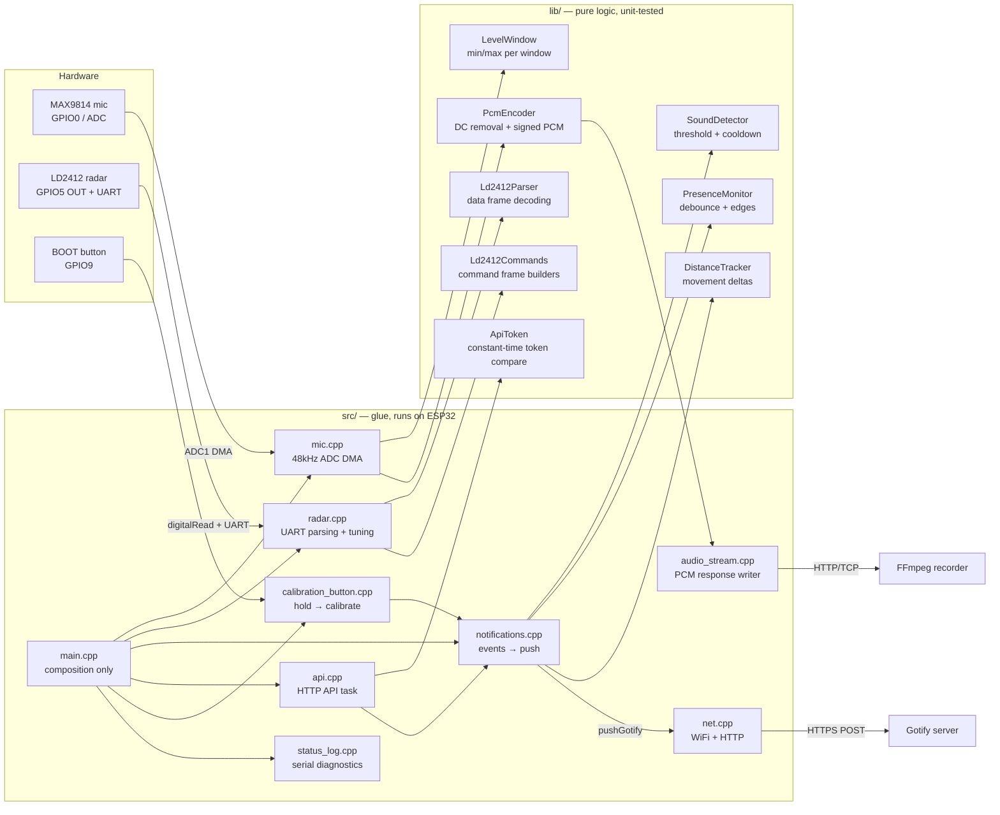

# Architecture

How the firmware is structured and why. For wiring see
[hardware.md](hardware.md); for build/flash see [flashing.md](flashing.md).

## Design principle

**Decision logic is separated from I/O.** Everything that decides *whether* to
notify lives in [`lib/detectors/`](../lib/detectors/) as header-only, pure C++
classes with no Arduino dependency — time is injected as a parameter, never
read inside. That makes the interesting behavior unit-testable on the host
(`pio test -e native`) without a board. Everything that touches hardware or
the network stays in [`src/`](../src/) as thin glue.

## Loop lifecycle

`setup()` runs once after boot/reset: serial, mic, radar and button init,
radar tuning (per-gate sensitivities via the LD2412 command protocol), WiFi
connect, HTTP API start, and a "Sensor node online" push. Then `loop()`
repeats forever:

1. **`micSampleWindow()`** — waits for the next 50ms `LevelWindow` produced by
  the dedicated ADC task. Hardware-timed DMA sampling continues at 48kHz
  while the loop performs network work, so short sounds cannot fall into a
  scheduling gap. The last completed window is kept for the HTTP API.
2. **`radarPoll()`** — feeds pending LD2412 UART bytes into `Ld2412Parser`
   for distance/energy reports.
3. **`calibrationButtonPoll()`** — BOOT button held ~1s starts radar
   background calibration (also available via `POST /calibrate`).
4. **`notifyPresenceChanges()`** — feeds the radar pin into `PresenceMonitor`;
   pushes "Person detected at X" / "Presence cleared" on debounced edges.
5. **`notifyMovement()`** — while present, `DistanceTracker` pushes "Person
   moved to X" when the distance shifts beyond `DISTANCE_DELTA_CM`.
6. **`notifyLoudSounds()`** — feeds the window's peak-to-peak into
   `SoundDetector`; pushes "Sound detected" above threshold, then cools down.
7. **`logStatusEverySecond()`** — one diagnostic line per second on serial.

One pass takes ~50ms because it waits for the next mic window. The ADC task
continues independently during the occasional blocking HTTP push.

## Audio pipeline

The microphone task reads 12-bit ADC1 samples from DMA, updates the sound-level
window, and passes each sample through `PcmEncoder`. The encoder tracks and
removes the MAX9814's DC bias, then maps the complete ADC range into signed
16-bit little-endian PCM without clipping. When a client is recording, samples
also enter a bounded 8192-sample ring buffer.

`api.cpp` authenticates `GET /audio.pcm`, then `audio_stream.cpp` drains that
ring buffer to the HTTP client. The API runs in a dedicated task, so network
backpressure never blocks ADC sampling or the sensor loop. When the buffer
fills, new stream samples are dropped and counted in `audioDroppedSamples`.
Sound detection still uses every ADC sample regardless of stream state.

## Notification semantics

Both detectors share the same delivery contract:

- **Events repeat until confirmed.** A detector keeps reporting its event
  until the caller confirms delivery via `notificationSent()`. A failed HTTP
  push (WiFi drop, server error) is therefore retried on the next loop pass,
  throttled by GOTIFY_RETRY_BACKOFF_MS so a failing server isn't hammered —
  no event is silently lost.
- **Debounce (presence):** the radar state must hold for
  `PRESENCE_DEBOUNCE_MS` before an edge counts; flicker resets the timer.
- **Cooldown (sound):** after a *delivered* sound notification, further sound
  events are suppressed for `SOUND_NOTIFY_COOLDOWN_MS`.

## Signal reference (mic)

12-bit ADC, MAX9814 biased at ~1.25V:

| Condition | Typical reading |
|---|---|
| Silent room | micMin ≈ 2600, micMax ≈ 2800, micPP ≈ 200–300 |
| Loud clap nearby | micPP ≈ 1500–4095 |
| Mic disconnected/floating | micMin ≈ 0, micMax ≈ 300 (WiFi noise pickup) |

The last row is the diagnostic signature for a wiring fault: a healthy mic
always shows the DC bias (~2600), a floating pin bounces near ground.

## Radar tuning and calibration

The LD2412 command protocol lives in `lib/ld2412/Ld2412Commands.h` (pure
frame builders, byte-for-byte unit-tested against the datasheet examples)
with the send/sequence logic in `radar.cpp`:

- **Boot tuning** — `radarApplyTuning()` writes gate range, unmanned duration
  and the per-gate motion/static sensitivity arrays from `config.h` on every
  boot (the module persists them in flash anyway; rewriting keeps the source
  of truth in git).
- **Background calibration** — `startCalibration()` (notifications module)
  triggers the module's background correction: starts 10s after the command,
  takes ~2 minutes, and must run with the room empty. Reachable from the
  BOOT button (hold ~1s) and `POST /calibrate`; both share the same entry
  point, which also pushes a "leave the room" warning via Gotify.

  Every command goes through `sendFrame()`, which flushes the UART and waits
  100ms — the module needs that gap to acknowledge before the next frame.

## HTTP API

`api.cpp` runs a `WebServer` task on port 80. All three endpoints —
`GET /status`, `POST /calibrate` and `GET /audio.pcm` — require `API_TOKEN`
from secrets.h, supplied as `Authorization: Bearer` or `X-Api-Key`. The
comparison itself lives in `lib/auth/ApiToken.h` so it can be tested natively:
it touches every byte of the expected token, so a rejection time does not
reveal how many leading bytes were right. A token shorter than 16 characters
fails the build. The audio handler owns the API task while its client is
connected, but ADC sampling, radar polling, notifications, and serial
diagnostics continue in their own execution paths. All handlers reuse module
accessors rather than owning sensor state.

The transport is plain HTTP, so the token and the audio both cross the LAN in
the clear. [SECURITY.md](../SECURITY.md) states what that does and does not
protect against.

## Extension points

- **More LD2412 commands** — add builders to `Ld2412Commands.h` (e.g.
  engineering mode for per-gate energy readouts) following the existing
  pattern: pure builder + byte-level Unity test against the protocol PDF in
  [datasheets/HLK-2412](datasheets/HLK-2412/).
- **New detectors** — follow the pattern: pure class in `lib/detectors/`,
  time injected, `notificationSent()` confirmation, Unity test in `test/`.
- **New API endpoints** — register handlers in `api.cpp`; keep them thin and
  read module state via accessors.
